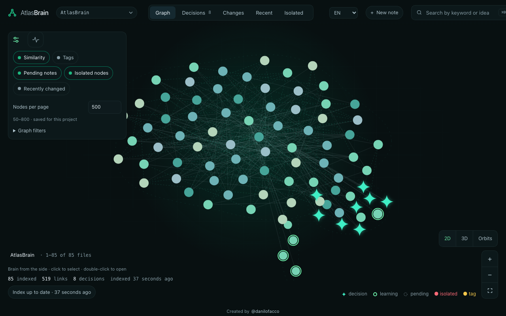
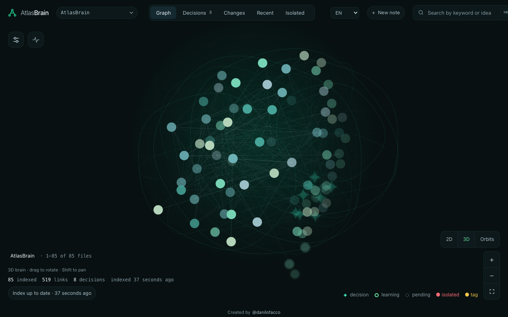
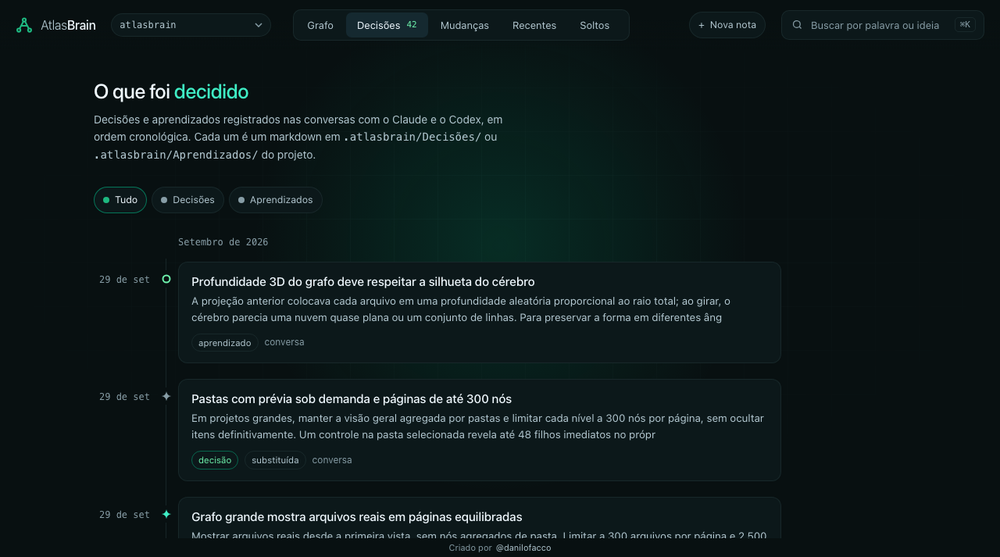
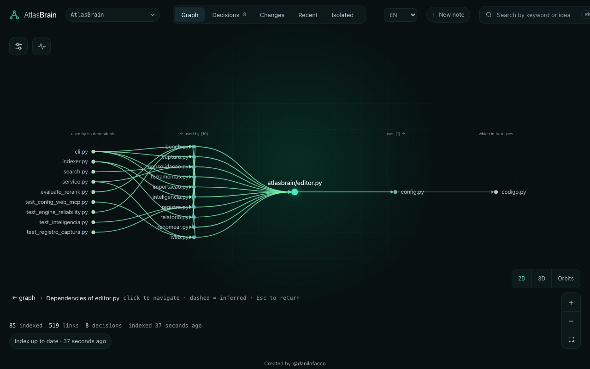
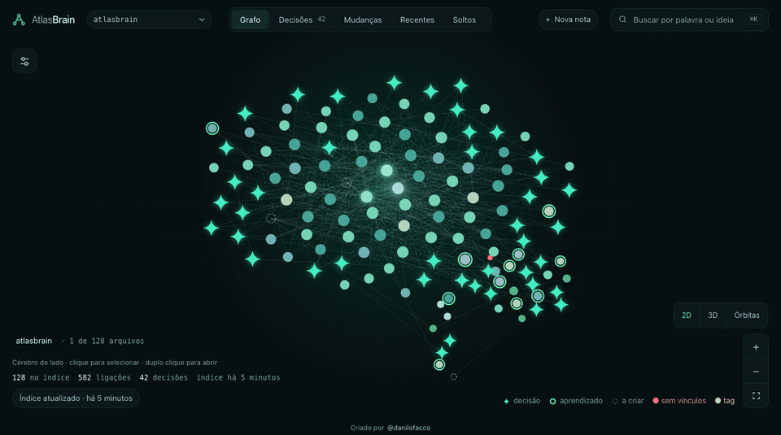
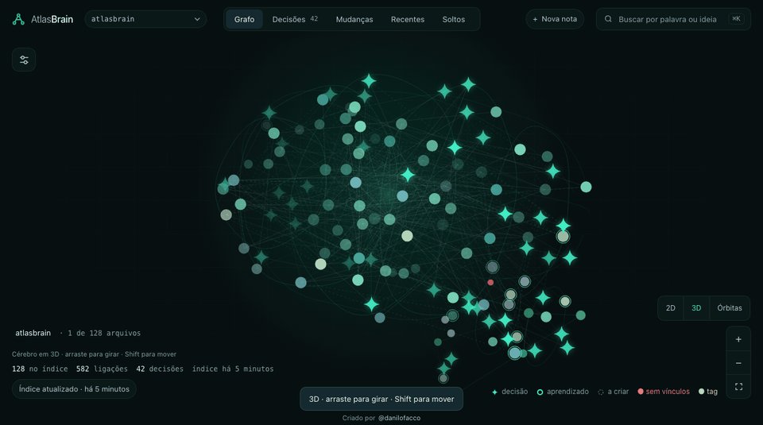

# AtlasBrain

**A local, open-source second brain for your code, notes, and AI assistants.**

AtlasBrain turns a project folder into searchable knowledge: it maps code
relationships, connects documents, and stores decisions and learnings as Markdown.
Through MCP (Model Context Protocol), Claude Code, Codex, and Antigravity can
retrieve that knowledge and save useful context for your next conversation.

Use it to understand an unfamiliar repository, investigate a bug, prepare a
refactor, or build a lasting knowledge base alongside your work. It also works
with folders of notes and research, without a code repository.

## Why use AtlasBrain?

| Benefit | How it helps |
| --- | --- |
| Find the right starting point | Search in natural language or look up exact files and symbols across code, notes, and documents. |
| Keep the reasoning behind your work | Record decisions, alternatives, and learnings so your assistant can retrieve them in later conversations. |
| Understand the impact of changes | Explore imports, calls, dependency paths, and affected files before editing unfamiliar code. |
| Give your assistant focused context | Collect relevant files, active decisions, and open Markdown tasks for a specific task within a configurable output budget. |
| Keep control of your knowledge | Store memory in ordinary Markdown and run the index and embeddings locally, without a paid search API or external database. |
| Work across several projects and clients | Keep each project's brain separate while reusing one shared AtlasBrain service and HTTP port. |

Your Markdown notes remain usable in Obsidian or any text editor. AtlasBrain runs
independently of Obsidian and does not require a plugin inside it.

## Preview



| 3D brain graph | Decision and learning timeline |
| --- | --- |
|  |  |

The light pulse is **disabled by default**. When enabled, it illuminates nodes and connections while idle. Toggle it
with the pulse icon beside settings. The 3D brain rotates automatically while idle
and pauses for interaction; drag to rotate it yourself.

### Dependency map

Open a code file and select **Dependency map** to inspect its incoming and outgoing
relationships.



These screenshots and GIFs use a demo made from public code and sample notes.

| 2D cortex pulse | 3D rotation |
| --- | --- |
|  |  |

## What you can do

- **Search code and knowledge together.** Combine keyword search, local multilingual
  embeddings, exact names, and symbol lookup. Filter by folder, tag, type, status,
  date, exact phrase, or excluded terms. PDFs, DOCX, and HTML are also searchable.
- **Explore your project visually.** Browse a brain-shaped 2D or 3D graph, or an
  orbital view. Inspect files, dependencies, notes, and connections; find isolated
  indexed files and review suggested links. Large projects use bounded pages of
  real file nodes to keep rendering manageable: **500 nodes per page by default**,
  adjustable from **50 to 800** in the graph controls. The preference is saved per project.
  A pulse icon beside the settings icon toggles cortex animation; idle 3D rotates
  automatically and pauses during interaction.
- **Maintain project memory.** Create and edit Markdown notes, decisions, and
  learnings through the interface or MCP. Explicitly supersede or revoke outdated
  decisions; active task context favors their current replacements.
- **Update notes with recovery in mind.** Use atomic saving, revision checks,
  section updates, and local version history. Rename or move indexed Markdown
  notes while updating resolved wikilinks and supported relative Markdown links.
- **Keep growing knowledge readable.** Create linked extractive summaries of
  eligible annotations, or provide a reviewed summary through MCP. Source notes
  remain intact, and changed sources flag their summaries as stale.
- **Bring references into the project.** Import public web pages and text-based
  PDFs as Markdown snapshots with their source URL and retrieval metadata.
- **Keep the index current.** The shared service watches external file changes and
  updates the index incrementally. Optional assistant hooks can capture useful
  conversation memory; version updates run when the service finds a newer release
  in a clean clone.

Code relationships extracted from source are distinguished from inferred
similarities and reviewed links. Suggested links need review. An isolated file
has no indexed connections; it is not necessarily unused.

### What gets indexed

In Git repositories, AtlasBrain includes tracked files and untracked files that
Git does not ignore. It skips dependency and build folders such as `node_modules`,
`.next`, `dist`, `build`, and Python virtual environments. Files already tracked by
Git remain eligible even if later added to `.gitignore`. Hidden folders are skipped
except for project memory notes in `.atlasbrain/`.

For additional exclusions, add patterns to `.atlasbrainignore`. In folders without
a Git repository, AtlasBrain uses its built-in exclusions and `.atlasbrainignore`;
`.gitignore` rules are not applied. Only supported file formats are indexed.

## Get started

For installation with automatic startup at login on macOS or Windows (WSL), follow the [automated installation guide](docs/automatic-installation.md). It installs Python and dependencies and configures HTTP clients. The manual steps below remain available.

Requirements: Git and [uv](https://docs.astral.sh/uv/getting-started/installation/), on macOS or Linux. Windows users can run the service in WSL, with clients able to reach its localhost port. Native Windows is currently unsupported. `uv` downloads Python 3.12 and installs the project's dependencies automatically.

### 1. Clone

Clone the public repository:

```bash
git clone https://github.com/danilofacco/atlasbrain.git
cd atlasbrain
```

### 2. Generate your MCP configuration

Replace `/absolute/path/to/my-project` with the folder you want to index. It can be a code repository or a folder of notes. Choose your client:

```bash
uv run --python 3.12 atlasbrain setup --vault /absolute/path/to/my-project --client claude
# Or: --client antigravity
# Or: --client codex
```

This installs dependencies, creates the project's `.atlasbrain/`, starts or reuses the shared service, and prints the configuration to paste into your client. No global Python install, symlink, API key, or manually installed dependency is needed. It does not edit your client's configuration automatically.

The first index downloads the local embedding model and can take longer. The service is available while indexing continues. To disable embeddings before starting it, set `ATLASBRAIN_NO_EMBED=1`; keyword search and code graphs still work.

### 3. Paste the configuration

| Client | Configuration location | Generated format |
| --- | --- | --- |
| Claude Code | `.mcp.json` in your target project | `mcpServers` with `type: "http"` and `url` |
| Antigravity | **MCP Servers → Manage MCP Servers → View raw config**, or `~/.gemini/config/mcp_config.json` | `mcpServers` with `serverUrl` |
| Codex app / CLI / IDE | `~/.codex/config.toml`, or `.codex/config.toml` in a trusted project | `[mcp_servers."atlasbrain"]` with `url` |

Merge the generated entry into an existing configuration rather than replacing other servers. Reconnect/reload the MCP client after changing its configuration. These Claude instructions are for **Claude Code**. For Claude Desktop chat, follow the [local bridge instructions](docs/claude-desktop.md) to reach the same service.

Step-by-step AtlasBrain guides: [Claude Code CLI](docs/claude-code.md), [Codex Desktop](docs/codex-desktop.md), [Codex CLI](docs/codex-cli.md), [Antigravity](docs/antigravity.md), and [OpenCode](docs/opencode.md).

Official instructions: [Claude Code](https://code.claude.com/docs/en/mcp), [Antigravity](https://antigravity.google/docs/mcp), [Codex](https://developers.openai.com/codex/mcp/).

To connect another client to the same project, run `setup` again with its client name: it reuses the same PID and port. To connect another project, change `--vault`. For multiple project entries in one client, also use `--name my-project` to give each entry a distinct name.

A project-specific MCP URL already fixes the project folder. On a global AtlasBrain connection, use `projects` to list registered folders and pass the absolute folder as `project_folder` on each project tool call. Without it, project tools ask for a folder instead of returning data from the global brain by mistake; `isolated_files` alone can list isolated files across all registered projects.

### Open the visual interface

**Default web port: `8765`.** After starting the service, open
[http://127.0.0.1:8765](http://127.0.0.1:8765) in your browser. The web interface
and MCP share this local service and port.

From the AtlasBrain checkout, run:

```bash
uv run atlasbrain serve --vault /absolute/path/to/my-project
```

This opens the project in your browser and reuses the shared service. The default
address is `http://127.0.0.1:8765`.

After restarting your computer, start the service again before using MCP:

```bash
uv run atlasbrain start --vault /absolute/path/to/my-project
```

Use `uv run atlasbrain status` to check it. The [operation guide](docs/features-and-operation.md)
explains service controls, automatic updates, optional hooks, and language coverage.
Claude Desktop uses a small client-side bridge; AtlasBrain itself remains one
shared service.

## Try it with your assistant

- “Find where authentication is implemented and explain who depends on it.”
- “Gather context for investigating why notifications are duplicated.”
- “What would be affected if I changed this function?”
- “Record this decision, including the alternatives and our reasoning.”
- “Mark the old decision as superseded by this one.”
- “Rename this note and update its Markdown links.”
- “Import this documentation URL and connect it to our project notes.”
- “Find isolated files and suggest connections for me to review.”

The interface defaults to **English**. Choose **PT-BR** in the top bar for Brazilian
Portuguese; the preference persists in your browser. Your file contents keep their original language.

Ask in Portuguese or English. MCP tool names, arguments and instructions use English:

| Goal | Tools |
| --- | --- |
| Locate and understand code | `find_files`, `symbol_location`, `explain`, `report` |
| Explore dependencies and impact | `query_graph`, `impact`, `graph_path`, `graph_map`, `isolated_files` |
| Retrieve task context and knowledge | `task_context`, `search`, `read`, `read_many`, `related`, `decisions` |
| Save and maintain memory | `create_note`, `record_decision`, `record_learning`, `edit_section`, `review_decision`, `rename_note` |
| Import and consolidate references | `import_url`, `plan_consolidation`, `consolidate_memory`, `refresh_summaries` |

For example, `authentication folder:src type:code` searches code inside `src`;
`queue type:decision status:active` searches active decisions about queues.
Legacy Portuguese tool names remain callable for existing clients, but only the
English names are advertised. Reconnect the MCP client to refresh its tool list.
On the global MCP endpoint, pass `project_folder` with the absolute project folder;
project-specific endpoints already bind that folder.

Queries containing only filters, such as `type:decision`, can also list matches.

## Where your data lives

```text
my-project/
├── .atlasbrain/
│   ├── Decisions/          # recorded decisions
│   ├── Learnings/     # learnings
│   ├── Imports/      # imported references
│   ├── Summaries/         # linked summaries
│   ├── REPORT.md      # generated architecture report
│   └── index.db          # local SQLite index
└── your code, notes, and documents
```

New memory folders use English names. Existing notes in Portuguese folders remain indexed in place, preserving their paths and links. Existing imports and summaries are reused; older MCP tool names and CLI flags remain compatibility aliases. Python modules, functions, and variables use English; persisted metadata and bilingual source content retain their original format.

Indexing and embedding inference run locally. Project memory in `.atlasbrain/`
is ignored by Git by default. Add paths to `.atlasbrainignore` to exclude them
from indexing. Shared service state and logs live in `~/.config/atlasbrain/`.

MCP returns requested content to your connected assistant, whose own data policies
still apply. Dependencies and the embedding model need internet access on first
installation, as do URL imports and version checks. Optional conversation capture
can invoke your configured Claude or Codex CLI.

Automatic consolidation selects excerpts; it does not independently generate new
reasoning or delete source files. URL imports read a single public page or PDF;
they do not crawl websites, execute JavaScript, or OCR scanned documents.

## Search quality and performance

Search is evaluated with source-reviewed questions in Portuguese and English,
separating calibration from validation and ranking accuracy from filter behavior.
The latest local comparison used 80 questions with reviewed answers plus 20 empty
filter scopes across five projects. With the model loaded, positive-query median
engine latency was **37.72 ms** and the expected file appeared in the top three in
**76.25%** of those questions. These describe one development benchmark; results
depend on the project, query, index, and hardware.

See the [performance report](docs/search-performance-evaluation.md),
[bilingual evaluation](docs/search-bilingual-evaluation.md), and
[benchmark instructions](benchmarks/README.md) for the method and reproducible runs.

## Further documentation

- [Features, language coverage, hooks, and service operation](docs/features-and-operation.md)
- [Claude Desktop connection](docs/claude-desktop.md)
- [Claude Code CLI installation and connection](docs/claude-code.md)
- [Codex Desktop installation and connection](docs/codex-desktop.md)
- [Codex CLI installation and connection](docs/codex-cli.md)
- [Antigravity installation and connection](docs/antigravity.md)
- [OpenCode installation and connection](docs/opencode.md)
- [Task context and Markdown renaming](docs/task-context-and-renaming.md)
- [Reliable memory updates and recovery](docs/reliable-memory.md)
- [Memory consolidation](docs/memory-consolidation.md)
- [Engine reliability and evaluation](docs/engine-reliability.md)

## Development

```bash
uv sync --locked
uv run pytest -q
# Optional visual interaction checks; Node.js is needed only for these tests:
node --test tests/viewer.test.cjs
```

Contributions are welcome. Include a reproducible example when reporting a bug;
for search issues, describe the question and expected file without sharing
private project contents.

Created by [Danilo Facco (@danilofacco)](https://github.com/danilofacco).
Licensed under [MIT](LICENSE).
